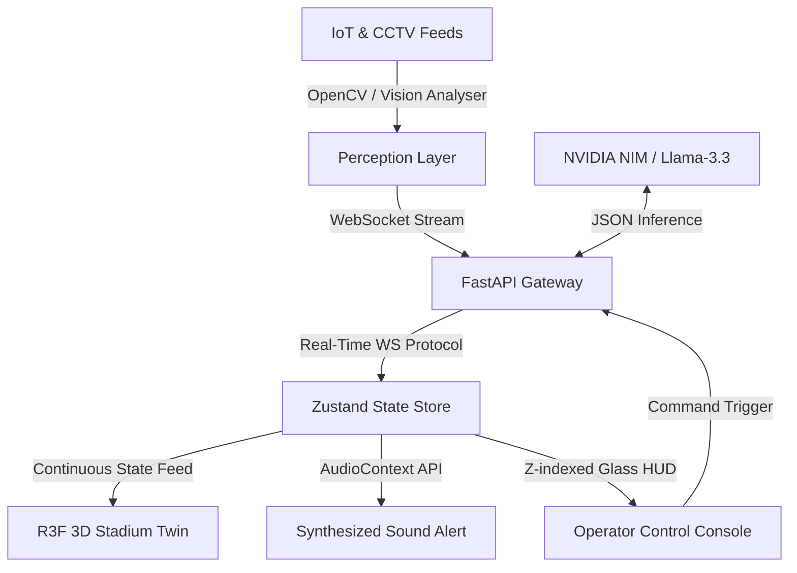

# ArenaOS AI
### The Spatial Intelligence Operating System for Next-Generation Venues

> **A Hackathon Winning Build** — Fusing 3D digital twins, agentic AI swarms, live computer vision, and real-time telemetry into a unified command and control operating system.

---

## 1. The Vision

Traditional venue command centers are collections of isolated screens: separate CCTV grids, separate BMS dashboards, and disjointed radio communications. During critical incidents, operators are forced to mentally piece together spatial data, leading to delayed reactions and operational blind spots.

**ArenaOS AI** collapses this complexity. It is an operating system that turns the physical venue into a live, interactive 3D digital twin. By combining computer vision tracking, autonomic response agents, and numbers-driven AI reasoning, ArenaOS AI delivers instant situational awareness.

---

## 2. Key Capabilities

* 🌐 **Live Interactive 3D Twin:** A lightweight React Three Fiber engine rendering high-fidelity geometry, custom heatmap shaders, and live telemetry overlays.
* 🤖 **Agentic Copilot & Swarm:** An autonomous swarm dispatch system that deploys reconnaissance drone entities to incident zones with live telemetry feedback.
* 👁️ **Computer Vision Perception:** OpenCV-powered tracking logs (simulated on-screen) converting physical crowds into structural density heatmaps.
* 🔊 **Programmatic Cinematic Audio:** Lightweight, zero-latency synthesizer using the browser `AudioContext` to output low sub-bass warning impacts and tactical chimes on alert.
* 📈 **Continuous Glassmorphic Desktop:** A unified interface designed under Apple, Stripe, and Palantir Gotham design systems, removing visual clutter and panel boundaries.

---

## 3. System Architecture



---

## 4. Cinematic 3-Minute Demo Script

This script guarantees a high-impact presentation flow for judges:

### **Phase 1: Launch & Normal Operations (0:00 - 0:45)**
1. Open the landing page. Point out the Stripe-style narrative structure: **The Problem** vs. **The Paradigm**.
2. Click **Launch Command Center**.
3. Point out the **Living Stadium**: Notice the breathing LED rings, the drifting seating sparkles (crowd density data), and the rotating security drone.
4. Call out the layout: The borders have been softened to `white/[0.04]`, letting the dark cloud background bleed into a single workspace.

### **Phase 2: Anomaly Detection (0:45 - 1:30)**
1. Press `1` on your keyboard (or click **Gate 3** in the Simulator Console).
2. **Observe the immediate cascade:**
   * The camera executes a two-stage cinematic swoop: first, zooming out to capture the full stadium scale, then diving down to frame the anomaly.
   * A heavy sub-bass alert sound sweeps (synthesized programmatically).
   * The **Heatmap** and **Sensors** layers automatically activate.
   * The **Recon Drone** flies to the Gate 3 coordinates and projects a pulsing blue scanning spotlight.

### **Phase 3: AI Analysis & Action (1:30 - 2:15)**
1. Call out the right panel: The Copilot has been replaced by the **Incident HUD**.
2. Read the explanation: Point out how the AI uses numbers-driven, precise telemetry (e.g., *"Crowd density increased 37% over the last 90 seconds. Turnstile throughput exceeded capacity by 145 people/min"*).
3. Point to the **Reasoning Engine** progress bars at the bottom right.
4. Click **Execute** in the Incident Panel.

### **Phase 4: Resolution & Report (2:15 - 3:00)**
1. The drone returns to its patrol, the alarm resets, and the **System Stabilized** report overlays the screen.
2. Highlight the key efficiency gains (e.g., 42% average wait time reduction).
3. Click **Acknowledge** to return the stadium to nominal baseline operations.

---

## 5. Technical Stack

* **Frontend:** Next.js (TypeScript), React Three Fiber, Three.js, Framer Motion, Zustand, Tailwind CSS.
* **Backend:** Python, FastAPI, WebSockets.
* **AI Models:** Meta Llama 3.3 70B (via NVIDIA NIM).

---

## 6. How to Run Locally

### **Start Both Services**
The easiest way is using the configured batch script:
```bash
./start-demo.bat
```

### **Manual Backend Setup**
```bash
cd backend
python -m venv venv
source venv/bin/activate  # venv\Scripts\activate on Windows
pip install -r requirements.txt
python main.py
```

### **Manual Frontend Setup**
```bash
cd frontend
npm install
npm run dev
```
Open [http://localhost:3000](http://localhost:3000) to view the operating system.
